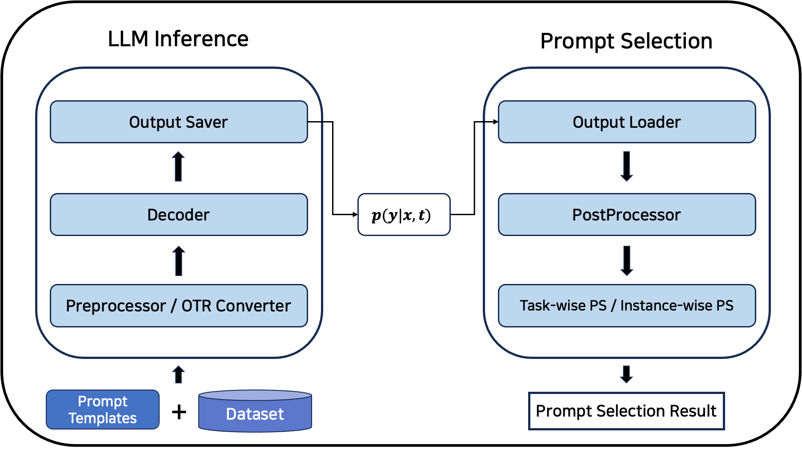
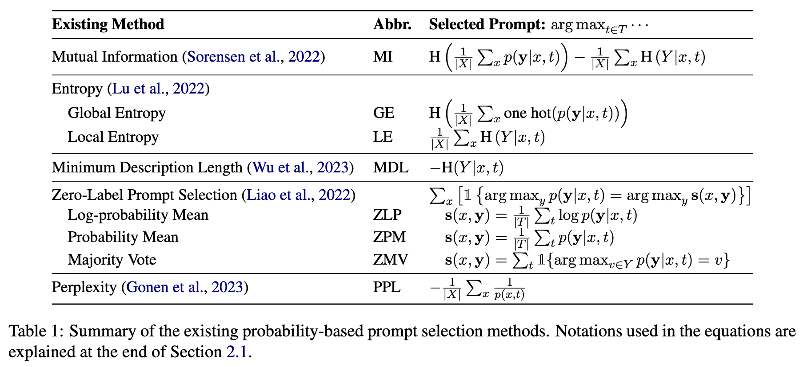
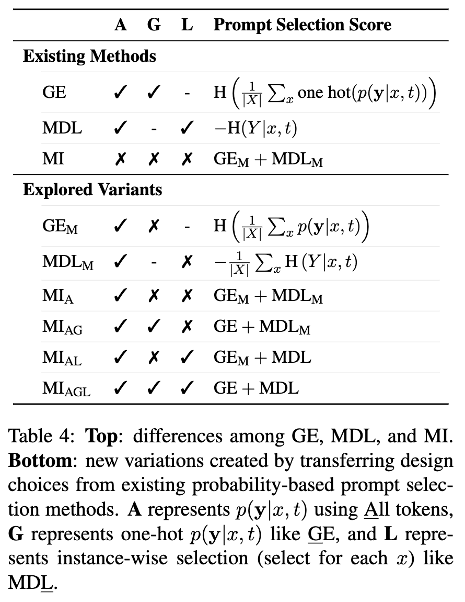

# Improving Probability-based Prompt Selection Through Unified Evaluation and Analysis

Official code for the paper [Improving Probability-based Prompt Selection Through Unified Evaluation and Analysis](https://arxiv.org/abs/2305.14877) accepted at TACL 2024.

You can read the summary of our paper in [this Twitter Thread](https://twitter.com/soheeyang_/status/1661339578240737287).

Use the following to cite our paper:

```jsx
@article{yang2024improving,
  title={Improving Probability-based Prompt Selection Through Unified Evaluation and Analysis},
  author={Yang, Sohee and Kim, Jonghyeon and Jang, Joel and Ye, Seonghyeon and Lee, Hyunji and Seo, Minjoon},
  journal={TACL},
  year={2024}
}
```

This repository provides a set of tools for easy utilization and unified evaluation of different probability-based prompt selection methods.

If you're interested in reproducing the experimental results mentioned in the paper, please refer to the [Reproduction](#reproduction) section.

## Features

1. Extraction of the language model's output probability necessary for prompt selection score calculation.
2. Probability-based prompt selection methods.
3. Calibration methods.
4. Task-wise prompt selection and Instance-wise prompt selection.
5. Custom prompt addition that conforms to the template format of [promptsource](https://github.com/bigscience-workshop/promptsource).

## Installation

Installation from the source. Python's virtual or Conda environments are recommended.

```bash
git clone git@github.com:soheeyang/unified-prompt-selection.git
cd unified-prompt-selection
pip install -r requirements.txt
```

Python version 3.9+ is required.

## Overview
<center></center>

LLMs predict the essential $p(y|x,t)$ through inference with given prompt candidates and datasets to calculate prompt selection scores. In the subsequent prompt selection process, the extracted $p(y|x,t)$ is loaded to calculate prompt selection scores. Based on these scores, a prompt is chosen, and the selection result is returned. OTR(One-Token Response) Converter is used when calculating $p(y|x,t)$ by utilizing only the first token logits.

## LLM inference & Prompt Selection

By running `run_prompt_selection.py`, you can extract $p(y|x,t)$ and select a prompt.

The extracted $p(y|x,t)$ through LLM inference is stored in the './extraction/results' directory. When running `run_prompt_selection.py` with the same configuration, it utilizes the previously saved extraction results without additional inference. For detailed information about inference, please refer to the $p(y|x,t)$ [Extraction](#pyxt-extraction) section.

```bash
python run_prompt_selection.py
```
Running the command as shown above will execute Prompt Selection according to the predefined default arguments.

You can also execute various combinations by adding `-m` or `--multirun` as follows:
```bash
python run_prompt_selection.py -m \
    method=MI,MI_G,MI_L,MI_GL,GE,GE_M,LE,MDL,MDL_M,ZLP,ZPM,ZMV,PPL,PPL_L \
    calibration=cbm-softmax,cbm-mean,cc-softmax,cc-mean,pmi-softmax,pmi-mean \
    decoder=opt-1.3b,opt-2.7b,opt-6.7b,opt-30b,opt-66b,gpt-neo-1.3b,gpt-neo-2.7b,gpt-j-6b,gpt2-xl,bloom-3b \
    dataset=sst2,ag_news,cb,imdb,newspop,rte,sst5,tweet_emotion,tweet_irony,piqa,copa,hellaswag,story_cloze \
    prompt=base_prompts,v12_prompts,v2_prompts,fewshot_prompt \
    first_token=false,true \
    sum_log_prob=false,true \
    fewshot=null,'1,2,4' \
    filter=false,true \
    unbalance=false,true
```

We used [hydra](https://hydra.cc/docs/intro/) to manage complex configurations. You can check the configurations in [`./conf`](./conf/), and besides specifying arguments on the command line, you can modify the arguments by editing the [`./conf/config.yaml`](./conf/config.yaml) file.

After executing `python run_prompt_selection.py`, you can verify the prompt selection result through the CLI. The result of executing the above command is as follows:

```bash
[2023-10-30 02:38:35,738][__main__][INFO] - 
    --------------------------------------------------------------------------------------------------------------------------------------------------------------------------
    Evaluation results using predictions from selected prompt.

    * X
       Accuracy:   0.5906
       F1 score:   0.5001
       Prediction: [1, 1, 1, 1, 1, 1, 1, 1, 1, 1, 1, 1, 1, 1, 1, 1, 1, 1, 1, 1, 0, 1, 1, 1, 1, 1, 1, 1, 1, 1, 1, 1, 1, 1, 1, 1, 1, 1, 1, 1, 1, 1, 1, 1, 1, 1, 1, 1, 1, 1] ...
       Target:     [1, 1, 1, 1, 1, 0, 1, 0, 1, 0, 0, 1, 1, 1, 1, 0, 1, 0, 1, 0, 0, 1, 0, 0, 0, 0, 0, 1, 0, 1, 1, 1, 1, 0, 1, 0, 1, 1, 0, 1, 1, 0, 0, 1, 1, 0, 1, 1, 0, 1] ...
       Correct:    [1, 1, 1, 1, 1, 0, 1, 0, 1, 0, 0, 1, 1, 1, 1, 0, 1, 0, 1, 0, 1, 1, 0, 0, 0, 0, 0, 1, 0, 1, 1, 1, 1, 0, 1, 0, 1, 1, 0, 1, 1, 0, 0, 1, 1, 0, 1, 1, 0, 1] ...

    * A
       Accuracy:   0.9186
       F1 score:   0.9183
       Prediction: [1, 1, 1, 1, 1, 0, 1, 0, 1, 0, 0, 1, 1, 1, 1, 0, 1, 0, 1, 0, 0, 1, 0, 0, 0, 0, 0, 1, 0, 1, 1, 1, 1, 0, 1, 1, 1, 1, 0, 1, 1, 1, 0, 1, 1, 0, 1, 1, 0, 1] ...
       Target:     [1, 1, 1, 1, 1, 0, 1, 0, 1, 0, 0, 1, 1, 1, 1, 0, 1, 0, 1, 0, 0, 1, 0, 0, 0, 0, 0, 1, 0, 1, 1, 1, 1, 0, 1, 0, 1, 1, 0, 1, 1, 0, 0, 1, 1, 0, 1, 1, 0, 1] ...
       Correct:    [1, 1, 1, 1, 1, 1, 1, 1, 1, 1, 1, 1, 1, 1, 1, 1, 1, 1, 1, 1, 1, 1, 1, 1, 1, 1, 1, 1, 1, 1, 1, 1, 1, 1, 1, 0, 1, 1, 1, 1, 1, 0, 1, 1, 1, 1, 1, 1, 1, 1] ...

    * P
       Accuracy:   0.5906
       F1 score:   0.5001
       Prediction: [1, 1, 1, 1, 1, 1, 1, 1, 1, 1, 1, 1, 1, 1, 1, 1, 1, 1, 1, 1, 0, 1, 1, 1, 1, 1, 1, 1, 1, 1, 1, 1, 1, 1, 1, 1, 1, 1, 1, 1, 1, 1, 1, 1, 1, 1, 1, 1, 1, 1] ...
       Target:     [1, 1, 1, 1, 1, 0, 1, 0, 1, 0, 0, 1, 1, 1, 1, 0, 1, 0, 1, 0, 0, 1, 0, 0, 0, 0, 0, 1, 0, 1, 1, 1, 1, 0, 1, 0, 1, 1, 0, 1, 1, 0, 0, 1, 1, 0, 1, 1, 0, 1] ...
       Correct:    [1, 1, 1, 1, 1, 0, 1, 0, 1, 0, 0, 1, 1, 1, 1, 0, 1, 0, 1, 0, 1, 1, 0, 0, 0, 0, 0, 1, 0, 1, 1, 1, 1, 0, 1, 0, 1, 1, 0, 1, 1, 0, 0, 1, 1, 0, 1, 1, 0, 1] ...

    * PA
       Accuracy:   0.9186
       F1 score:   0.9183
       Prediction: [1, 1, 1, 1, 1, 0, 1, 0, 1, 0, 0, 1, 1, 1, 1, 0, 1, 0, 1, 0, 0, 1, 0, 0, 0, 0, 0, 1, 0, 1, 1, 1, 1, 0, 1, 1, 1, 1, 0, 1, 1, 1, 0, 1, 1, 0, 1, 1, 0, 1] ...
       Target:     [1, 1, 1, 1, 1, 0, 1, 0, 1, 0, 0, 1, 1, 1, 1, 0, 1, 0, 1, 0, 0, 1, 0, 0, 0, 0, 0, 1, 0, 1, 1, 1, 1, 0, 1, 0, 1, 1, 0, 1, 1, 0, 0, 1, 1, 0, 1, 1, 0, 1] ...
       Correct:    [1, 1, 1, 1, 1, 1, 1, 1, 1, 1, 1, 1, 1, 1, 1, 1, 1, 1, 1, 1, 1, 1, 1, 1, 1, 1, 1, 1, 1, 1, 1, 1, 1, 1, 1, 0, 1, 1, 1, 1, 1, 0, 1, 1, 1, 1, 1, 1, 1, 1] ...

    Note that some datasets are missing label values, 
    so check the target results.

    The predictions of the selected prompt were saved in the following file.

    './results/dataset=glue_sst2_validation__decoder=facebook--opt-2.7b__prompt=base_prompts__first_token=False__sum_log_prob=False__num_samples=1000__seed=42__fewshot=None__do_eval=True/method=MI__all_tokens=True__one_hot=False__select_for_each_x=False__cali_type=cbm__cali_norm_type=softmax__filter=False__unbalance=False.json'
    
    --------------------------------------------------------------------------------------------------------------------------------------------------------------------------
```

You can obtain four different results depending on whether calibration is applied:

 * **X**: without applying any calibration

 * **A**: applying calibration only for **A**nswer selection

 * **P**: applying calibration only for **P**rompt selection

 * **PA**: applying calibration for both **P**rompt selection and **A**nswer selection.

The prompt selection result is saved in the [`‘./results/dataset=""__decoder=""__prompt=""__first_token=""__sum_log_prob=""__num_samples=""__seed=""__fewshot=""__do_eval=""/method=""__using_all_tokens=""__one_hot=""__select_for_each_x=""__filter=""__unbalance="".json’`](./results/) file. The format of the result file is as follows:

<details>
<summary>Prompt selection result format</summary>
<div markdown="1">

```json
    {
        "X": {
            "method": "...",
            "cali_type": "...",
            "cali_norm_type": "...",
            "accuracy": "...",
            "macro_f1": "...",
            "model": [
              "...",
              "..."
            ],
            "task": [
              "...",
              "..."
            ],
            "token": [
              "...",
              "..."
            ],
            "instance": [
              "...",
              "..."
            ],
            "prompt": [
              "...",
              "..."
            ],
            "prediction": [
              "...",
              "..."
            ],
            "target": [
              "...",
              "..."
            ]
        },
    	"A": {
            "method": "...",
            "cali_type": "...",
            "cali_norm_type": "...",
            "accuracy": "...",
            "macro_f1": "...",
            "model": [
              "...",
              "..."
            ],
            "task": [
              "...",
              "..."
            ],
            "token": [
              "...",
              "..."
            ],
            "instance": [
              "...",
              "..."
            ],
            "prompt": [
              "...",
              "..."
            ],
            "prediction": [
              "...",
              "..."
            ],
            "target": [
              "...",
              "..."
            ]
        },
        "P": {
            "method": "...",
            "cali_type": "...",
            "cali_norm_type": "...",
            "accuracy": "...",
            "macro_f1": "...",
            "model": [
              "...",
              "..."
            ],
            "task": [
              "...",
              "..."
            ],
            "token": [
              "...",
              "..."
            ],
            "instance": [
              "...",
              "..."
            ],
            "prompt": [
              "...",
              "..."
            ],
            "prediction": [
              "...",
              "..."
            ],
            "target": [
              "...",
              "..."
            ]
        },
        "PA": {
            "method": "...",
            "cali_type": "...",
            "cali_norm_type": "...",
            "accuracy": "...",
            "macro_f1": "...",
            "model": [
              "...",
              "..."
            ],
            "task": [
              "...",
              "..."
            ],
            "token": [
              "...",
              "..."
            ],
            "instance": [
              "...",
              "..."
            ],
            "prompt": [
              "...",
              "..."
            ],
            "prediction": [
              "...",
              "..."
            ],
            "target": [
              "...",
              "..."
            ]
        },
    }
```
</div>
</details>
<br>

Notes:
- When applying prompt selection to a dataset without ground truth labels, prompt selection is possible, but evaluation results cannot be verified. **Before applying prompt selection to a dataset, check whether ground truth labels are available or not** or **check whether the evaluation results for datasets without ground truth labels are based on the Target of the prompt selection results.**

### Probability-based Prompt Selection Method

<center></center>

The following probability-based prompt selection methods are available: 'MI', 'GE', 'LE', 'MDL', 'ZLP', 'ZPM', 'ZMV', and 'PPL'.

To use a specific prompt selection method, pass the desired method to `method`. You can find detailed descriptions of each method in section 2.2 Existing Approaches of the [paper](https://arxiv.org/pdf/2305.14877.pdf).

### Variants created by Prompt Selection Methods

<p align="center" width="100%">

</p>

The following methods are variants that modify the score calculation formula of existing Probability-based prompt selection methods: 'MI_G', 'MI_L,' 'MI_GL', 'GE_M', 'MDL_M', and 'PPL_L'.

You can check the arguments specific to these probability-based prompt selection methods in the [`./conf/method`](./conf/method/) directory.

If a method name is followed by '_L', it means that [`select_for_each_x`](./conf/method/MI_L.yaml) is set to 'True', and instance-wise prompt selection is performed. The methods that support instance-wise prompt selection are 'MDL', 'MI', and 'PPL'.

If a method name is followed by '_G', it means that [`one_hot`](./conf/method/MI_G.yaml) is set to 'True', and one-hot $p(y|x,t)$ is used for GE calculation.

### Adding Custom Prompt Selection Method

If you want to add a new prompt selection method, refer to the [./method/methods.py](./method/methods.py) module. Check other methods in this module, and create a new method according to the types and dimensions of input and output values.

||Task-wise Method|Instance-wise Method|
|:---------:|:-------:|:------------:|
|Input Variable|`template_prob`|`tensor_dict_prob`|
|Input Variable Type|torch.Tensor|torch.Tensor|
|Input Variable Dimension|[X, Y]|[T, X, Y]|
|Output Value Type|torch.Tensor|Tuple[List[float], List[int]]|
|Output Value Dimension|[1]|([X], [X])|

- **T** : The number of prompts
- **X** : The number of instances
- **Y** : The number of answer choices

The Instance-wise Method has two lists as output values. The first list should contain the results of calculated instance-wise prompt selection scores using the added method, and the second list should contain the indices of the selected prompts for each instance.

The newly added method is utilized in the `get_*_wise_ps_scores` function in the [./method/score.py](./method/score.py) module.

```python
methodFuncMap = {
    'MI': get_mi_g if one_hot else get_mi,
    'GE': get_ge if one_hot else get_ge_m,
    'LE': get_le,
    'MDL': get_le,
    'PPL': get_ppl,
    'ZLP': get_zlp,
    'ZPM': get_zpm,
    'ZMV': get_zmv,
}
```

When adding a method, follow the format of the method in the methodFuncMap inside the `get_*_wise_ps_result` function. Additionally, add a yaml file representing the new method to [`./conf/method`](./conf/method/) directory. Refer to the yaml file format of other methods in `./conf/method`

### Calibration Method

Three calibration methods are available, allowing you to observe the changes in prompt selection results before and after applying each calibration.

You can check the arguments related to calibration in the [`./conf/calibration`](./conf/calibration/) directory.

You can choose one of the following calibration methods by specifying 'cbm', 'cc', or 'pmi' to [`cali_type`](./conf/calibration/cbm-softmax.yaml). The default value is 'cbm'.

- **cbm**: Calibration By Marginalization, an enhanced calibration method proposed in this work that demonstrates effective results in prompt selection compared to existing methods.
- **cc**: Contextual Calibration, a calibration method proposed in [Calibrate before use: Improving Few-Shot performance of language models](https://arxiv.org/pdf/2102.09690.pdf).
- **pmi**: Domain Conditional PMI, a calibration method proposed in [Surface form competition: Why the highest probability answer isn’t always right](https://arxiv.org/pdf/2104.08315.pdf).

You can specify the normalization criteria for $\tilde{q}(y|x,t)$ using [`cali_norm_type`](./conf/calibration/cbm-softmax.yaml). The options are 'softmax' or 'mean', and the default value is 'softmax'.

### Dynamic Dataset
Dynamic datasets are datasets where answer choices are not fixed and vary for each instance. The experiment includes COPA, PIQA, StoryCloze, and Hellaswag as dynamic datasets. With such datasets, you can adjust the label distribution differently and observe the changes in prompt selection results based on the label distribution.

If you set [`unbalance`](./conf/config.yaml) to 'True', you can adjust the label distribution of COPA, PIQA, StoryCloze, and Hellaswag to be unbalanced at a ratio of 100:0 and observe the prompt selection results.

### Filter
In [Zero-Label Prompt Selection](https://arxiv.org/abs/2211.04668), a low-quality prompt filtering algorithm using k-means clustering and $p(y|x,t)$ was proposed. By setting [`filter`](./conf/config.yaml) to 'True', prompts can be filtered using the zero-label prompt selection (ZPS) filtering algorithm.

### $p(y|x,t)$ Extraction

To perform probability-based prompt selection, you need to extract the output probability of the language model, denoted as $p(y|x,t)$, where $x,t$ represents the instantiated prompt.

If desired, it is also possible to perform LLM inference excluding prompt selection and extract $p(y|x,t)$ using the `run_inference.py` script.

```bash
python run_inference.py \
    decoder=opt-2.7b \
    dataset=sst2 \
    prompt=base_prompts \
    first_token=false \
    sum_log_prob=false \
    num_samples=1000 \
    seed=42 \
    fewshot=null \
    do_eval=true \
    mixed_precision=no
```

The arguments that affect extraction can be found in [`./conf/config.yaml`](./conf/config.yaml).

To calculate $p(y|x,t)$ using only the first token of $y$, set the [`first_token`](./conf/config.yaml) to 'True'. If set to 'False', all tokens of $y$ are used.

When calculating $p(y|x,t)$ using all tokens over $y$, you have the option to calculate either the mean log-probability or the sum of log-probability for all tokens over $y$. To extract the sum of log-probability for all tokens over $y$, set [`sum_log_prob`](./conf/config.yaml) to 'True'.

To adjust the dataset sample size for prompt selection, use the [`num_samples`](./conf/config.yaml).

For reproducibility, you can set the random seed by using the [`seed`](./conf/config.yaml).

If you want to select one of the fewshot prompts with a different number and order of examples for a single prompt template, you can use [`fewshot`](./conf/config.yaml).
<details>
<summary>Detailed Explanation of the `fewshot`</summary>
<div markdown="1">

- The values that can be passed to [`fewshot`](./conf/config.yaml) are '1', '2', '4', '1,2', '1,4', '2,4', '1,2,4'. Each number represents the number of randomly selected examples from the training dataset for the fewshot prompt.

- Passing '1' saves eight outputs of fewshot prompts with a single example, and then one of the eight prompts is selected. Passing '2' saves 20 outputs, and passing '4' saves 72 outputs. If multiple values are passed by concatenating them with ',', 100 (8+20+72) outputs are saved, and one of the 100 fewshot prompts, which is expected to work best, is selected.
</div>
</details>
<br>

Through the [`do_eval`](./conf/config.yaml), you can choose whether to record evaluation results ('Accuracy', 'Macro F1') for each prompt during the inference stage for extraction. If set to 'False,' prompt selection can still be performed even if there is no ground truth label in the dataset. However, you will only be able to verify what the final selected prompt is and its predictions.

Notes:
- The results of $p(y|x,t)$ extraction are saved under the [`./extraction/results/dataset=""__decoder=""__prompt=""__first_token=""__sum_log_prob=""__num_samples=""__seed=""__fewshot=""__do_eval=""`](./extraction/results/) directory. 
- If results have already been extracted with the same arguments (i.e., the directory with the same name exists under [`./extraction/results`](./extraction/results/)), the existing results will be provided, and additional extraction will not be performed.
- If a directory with the same name exists but the names of the selected prompt templates have changed in the settings, additional extraction will only be carried out for prompts with names that were not previously extracted.
- $p(y|x,t)$ extraction results from each prompt will be saved as JSON files under the directory. The output file has the following format:

<details>
<summary>Extraction output format</summary>
<div markdown="1">

```json
    {
        "dataset_name": "...",
        "dataset_config_name": "...",
        "template_name": "...",
        "evaluation": null,
        "raw": {
            "inputs": [
              "...",
              "...",
              "...",
            ],
            "predictions": [
              "...",
              "...",
              "...",
            ],
            "targets": [
              "...",
              "...",
              "...",
            ],
            "accuracy": [
              "...",
              "...",
              "...",
            ],
            "f1": null,
            "log_prob": [
              [
                "...",
                "..."
              ],
              [
                "...",
                "..."
              ],
              [
                "...",
                "..."
              ],
            ],
            "empty_log": [
              [
                "...",
                "..."
              ]
            ],
            "na_log": [
              [
                "...",
                "..."
              ]
            ],
            "mask_log": [
              [
                "...",
                "..."
              ]
            ],
            "P(x,t)": [
              "...",
              "...",
              "...",
            ],
            "P(t)": [
              "..."
            ]
        }
    }
```
</div>
</details>
<br>

### Decoder
If you want to specify a particular model, you can pass the desired model name to the decoder. The models used in the experiment can be found in [`./conf/decoder`](./conf/decoder/).

You can also add new models by adding .yaml files under [`./conf/decoder`](./conf/decoder/). You can refer to existing files to configure the arguments.

Pass the desired model name to [`model_name_or_path`](./conf/decoder/opt-2.7b.yaml). Adding models is limited to the decoder models supported by the Hugging Face [`transformers`](https://huggingface.co/models) library.

❗ Verify the `pad_token_id` of the tokenizer to be used and pass the verified `pad_token_id` to [`ignore_index`](./conf/decoder/opt-2.7b.yaml).

To apply model parallelism, use the [`parallelize`](./conf/decoder/opt-2.7b.yaml).

You can adjust the batch size by using the [`per_device_eval_batch_size`](./conf/decoder/opt-2.7b.yaml).

### Dataset
If you want to specify a particular dataset, you can pass the desired dataset name to `dataset`. The datasets used in the experiment can be found in [`./conf/dataset`](./conf/dataset/).

You can also add new datasets by adding `.yaml` files under [`./conf/dataset`](./conf/dataset/). You can refer to existing files to configure the arguments. To manage and utilize prompts, we rely on [promptsource](https://github.com/bigscience-workshop/promptsource). Therefore, adding new datasets is limited to classification [datasets existing in promptsource](./extraction/promptsource/templates/).

[`dataset_name`](./conf/dataset/story_cloze.yaml) corresponds to the `path` argument of the [`load_dataset`](https://huggingface.co/docs/datasets/v2.13.0/en/package_reference/loading_methods#datasets.load_dataset) method in the Hugging Face [`datasets`](https://huggingface.co/datasets) library.

[`dataset_config_name`](./conf/dataset/story_cloze.yaml) corresponds to the `name` argument.

[`split`](./conf/dataset/story_cloze.yaml) corresponds to the `split` argument.

[`DATASET_KWARGS`](./conf/dataset/story_cloze.yaml) are automatically determined based on the configured [`dataset_name`](./conf/dataset/story_cloze.yaml), [`dataset_config_name`](./conf/dataset/story_cloze.yaml), and [`split`](./conf/dataset/story_cloze.yaml).

[`DATASET_INFO`](./conf/dataset/story_cloze.yaml) is required for OTR (=One Token Response, [`first_token`](./conf/config.yaml)=True).
- [`num_classes`](./conf/dataset/story_cloze.yaml) should be set to the number of label categories.
- [`label`](./conf/dataset/story_cloze.yaml) should be set to the column name containing ground truth labels for the dataset. If it doesn't exist, you can set it to null. In such cases, don't forget to set the `do_eval` option to 'False' as well.
- [`is_dynamic`](./conf/dataset/story_cloze.yaml) should be set to True if the dataset you want to add is a dynamic task; otherwise, set it to False. For an explanation of dynamic tasks, refer to [Dynamic Dataset](#dynamic-dataset).
- [`choices`](./conf/dataset/story_cloze.yaml) should be set to values corresponding to the [answer_choices](./extraction/promptsource/templates/story_cloze/2016/templates.yaml) associated with the dataset's prompt templates.

[`TEMPLATE_INFO`](./conf/dataset/story_cloze.yaml) is required for [Custom Prompt Addition](#custom-prompt-addition). Set [`text_format`](./conf/dataset/story_cloze.yaml) to the column name containing text in the appropriate format and [`jinja_suffix`](./conf/dataset/story_cloze.yaml) to the column name containing ground truth labels in the format specified by [jinja](./extraction/promptsource/templates/story_cloze/2016/templates.yaml).

Note:

- If you want to apply a dataset that is not present in promptsource, you will need a [`templates.yaml`](./extraction/promptsource/templates/story_cloze/2016/templates.yaml) file that adheres to the format used by promptsource. We recommend creating this file by referring to examples in the promptsource documentation and [`templates.yaml`](./extraction/promptsource/templates/story_cloze/2016/templates.yaml) files for other datasets. Also, please note that if there are no ground truth labels, you can create the [jinja](./extraction/promptsource/templates/story_cloze/2016/templates.yaml) section without adding [`jinja_suffix`](./conf/dataset/story_cloze.yaml).


### Prompt
You can find the list of prompts used in the experiment in the `.yaml` files under [`conf/prompt`](./conf/prompt/).

The prompts you want to use can be configured through `prompt`. Create a `.yaml` file under [`conf/prompt`](./conf/prompt/) and pass the name of the created file to prompt.

[`prompt_config_name`](./conf/prompt/base_prompts.yaml) affects the directory name where the results of $p(y|x,t)$ extraction are stored (`'prompt=&{prompt_config_name}'`).

By entering the [name](./extraction/promptsource/templates/story_cloze/2016/templates.yaml)s of prompt templates as a list in [`template_names`](./conf/prompt/base_prompts.yaml), you can select prompts from those templates.

If you want to add new prompts, refer to [Custom Prompt Addition](#custom-prompt-addition).

## Custom Prompt Addition

To manage and utilize prompts, we rely on [promptsource](https://github.com/bigscience-workshop/promptsource). For more information on adding prompts, refer to promptsource.

You can add a prompt by running add_prompt.py.

Here is an example of adding a prompt for the 'ag_news' dataset:

```bash
python add_prompt.py dataset=ag_news
```

### Instruction

When running `python add_prompt.py dataset=ag_news`, follow the instructions below:

```
Instruction example:
"{{ text }}" is about

Enter the instruction for the new prompt, using the example format provided above:
```

The placeholder '{{ ... }}' represents the location where the instance of the dataset will be inserted. The ... refers to the column name that contains the instances for each dataset.

```
Instruction example:
"{{ text }}" is about

Enter the instruction for the new prompt, using the example format provided above:
{{ text }} this is test_add_prompt.

Please verify that the entered instruction is correct:
{{ text }} this is test_add_prompt.

If the instruction is correct, press 'y'; otherwise, enter another key.
If you choose another key, you will be able to edit the instruction: y
```

Follow the provided example and input the desired instruction accordingly.

Notes:
- <details>
  <summary>The instruction must include '{{ ... }}'.</summary>
  <div markdown="1">

  ```
  Instruction example:
  "{{ text }}" is about

  Enter the instruction for the new prompt, using the example format provided
  above:
  this is test_add_prompt.

  The instruction is missing '{{ text }}'. Please enter the instruction again.
  ```

  </div>
  </details>

### Answer Choices

```
Answer_choices example:
politics ||| sports ||| business ||| science

Enter the answer_choices for the new prompt, using the example format provided above:
```

After entering the instruction, input the answer_choices.

```
Answer_choices example:
politics ||| sports ||| business ||| science

Enter the answer_choices for the new prompt, using the example format provided above:
politics ||| sports ||| business ||| science

Please verify that the entered answer_choices are correct:
politics ||| sports ||| business ||| science

If the answer_choices are correct, press 'y'; otherwise, enter another key.
If you choose another key, you will be able to edit the answer_choices: y
```

Enter the desired answer_choices according to the provided example.

Notes:
- <details>
  <summary>If you omit " ||| ", you will need to enter the answer_choices again.</summary>
  <div markdown="1">

  ```
  Answer_choices example:
  politics ||| sports ||| business ||| science

  Enter the answer_choices for the new prompt, using the example format provided above:
  politics sports business science

  Each answer_choice must be entered separated by " ||| ". Please enter the answer_choices again.

  ```

  </div>
  </details>

- <details>
  <summary>If the number of answer_choices is different from the number of labels, you will need to enter the answer_choices again.</summary>
  <div markdown="1">

  ```
  Answer_choices example:
  politics ||| sports ||| business ||| science

  Enter the answer_choices for the new prompt, using the example format provided above:
  politics ||| sports

  The number of answer_choices must be 4. Please enter the answer_choices again.
  ```

  </div>
  </details>
    

### Prompt Name


Prompt name is used to identify and utilize the added prompt. After entering the answer_choices, input the prompt name to identify the added prompt.

```
Enter the prompt name: test_add_prompt

Please verify that the entered prompt name is correct:
test_add_prompt

If the prompt name is correct, press 'y'; otherwise, enter another key.
If you choose another key, you will be able to edit the prompt name: y
```

Notes:
- <details>
  <summary>The prompt name cannot be duplicated.</summary>
  <div markdown="1">

  ```
  Enter prompt name: prompt_00

  A prompt with the same name already exists.
  ```

  </div>
  </details>

### Checking Custom Prompt

Added prompts are saved in the following files, depending on the [`dataset_name`](./conf/dataset/ag_news.yaml) and [`dataset_config_name`](./conf/dataset/ag_news.yaml):

`./extraction/promptsource/templates/{dataset_name/dataset_config_name}/templates.yaml` 

You can check the example prompt that was added in the following file:

[`./extraction/promptsource/templates/ag_news/templates.yaml`](./extraction/promptsource/templates/ag_news/templates.yaml)


Here is an example of how to use the added prompt:

```python
# Load an example from the datasets ag_news
>>> from datasets import load_dataset
>>> dataset = load_dataset("ag_news", split="train")
>>> example = dataset[1]

# Load prompts for this dataset
>>> from extraction.promptsource.templates import DatasetTemplates
>>> ag_news_prompts = DatasetTemplates('ag_news')

# Select a prompt by its name
>>> prompt = ag_news_prompts["test_add_prompt"]

# Apply the prompt to the example
>>> result = prompt.apply(example)
>>> print("INPUT: ", result[0])
INPUT:  Carlyle Looks Toward Commercial Aerospace (Reuters) Reuters - Private investment firm Carlyle Group,\which has a reputation for making well-timed and occasionally\controversial plays in the defense industry, has quietly placed\its bets on another part of the market. this is test_add_prompt.
>>> print("TARGET: ", result[1])
TARGET:  business
```

This example demonstrates how to load the ag_news dataset, load the prompts for the dataset, select the prompt named "test_add_prompt," and apply it to an example from the dataset. The result shows the input with the applied prompt and the corresponding target label.


## Reproduction

```
❗ To download the extracted p(y|x,t) output for the experiment, approximately 50GB of free space is required. 
   If you don't have enough space, you can directly download the Prompt Selection Score result.
```

If you want to reproduce the entire set of experimental results, including results for all datasets and models, please follow the instructions below.

### Preparing $p(y|x,t)$
To reproduce the results, you need to extract the required $p(y|x,t)$ for prompt selection. The $p(y|x,t)$ used in the experiment can be downloaded using the following command:

```bash
python ./reproduction/download_experimental_results.py --result inference
```

Notes:

- The prompts used in the experiment can be found in the [`./extraction/promptsource/templates`](./extraction/promptsource/templates/) directory. The prompts used in the experiment are specified in the `templates.yaml` file located in the directory of the dataset you want to reproduce.

### Prompt Selection Score Result

After preparing the $p(y|x,t)$, you can use the following command to download all prompt selection results in the experiment:

```bash
python ./reproduction/download_experimental_results.py --result prompt_selection
```

All datasets, models, and prompt selection method results used in the experiment will be saved in the [`./reproduction/ps_results`](./reproduction/ps_results/) directory.

### Visualizing the Result

Once you have prepared [`./reproduction/ps_results`](./reproduction/ps_results/), you can refer to [`figures_ver2_tacl.ipynb`](./reproduction/figures_ver2_tacl.ipynb) and [`figures_ver1_arxiv.ipynb`](./reproduction/figures_ver1_arxiv.ipynb) to recreate the figures presented in the paper.

---
### Reproduce by Running Commands Directly
Extracting $p(y|x,t)$ for all prompts, datasets, and models used in the experiment requires a significant amount of resources and time. However, if you want to reproduce the results directly, you can use the following commands:

```bash
python run_prompt_selection.py -m \
    method=MI,MI_G,MI_L,MI_GL,GE,GE_M,LE,MDL,MDL_M,ZLP,ZPM,ZMV,PPL,PPL_L \
    calibration=cbm-softmax,cbm-mean,cc-softmax,cc-mean,pmi-softmax,pmi-mean \
    decoder=opt-1.3b,opt-2.7b,opt-6.7b,opt-30b,opt-66b,gpt-neo-1.3b,gpt-neo-2.7b,gpt-j-6b,gpt2-xl,bloom-3b \
    dataset=sst2,ag_news,cb,imdb,newspop,rte,sst5,tweet_emotion,tweet_irony \
    prompt=base_prompts \
    sum_log_prob=false \
    filter=false,true
```

```bash
python run_prompt_selection.py -m \
    method=MI,MI_G,MI_L,MI_GL,GE,GE_M,LE,MDL,MDL_M,ZLP,ZPM,ZMV,PPL,PPL_L \
    calibration=cbm-softmax,cbm-mean,cc-softmax,cc-mean,pmi-softmax,pmi-mean \
    decoder=opt-2.7b \
    dataset=sst2,ag_news,cb,imdb,newspop,rte,sst5,tweet_emotion,tweet_irony \
    prompt=v1_prompts,v12_prompts \
    sum_log_prob=false \
    filter=false,true
```

```bash
python run_prompt_selection.py -m \
    method=MI,MI_G,MI_L,MI_GL,GE,GE_M,LE,MDL,MDL_M,ZLP,ZPM,ZMV,PPL,PPL_L \
    calibration=cbm-softmax,cbm-mean,cc-softmax,cc-mean,pmi-softmax,pmi-mean \
    decoder=opt-2.7b \
    dataset=sst2,ag_news,cb,imdb,newspop,rte,sst5,tweet_emotion,tweet_irony \
    prompt=fewshot_prompt \
    fewshot='1,2,4' \
    sum_log_prob=false \
    filter=false,true
```

```bash
python run_prompt_selection.py -m \
    method=MI,MI_G,MI_L,MI_GL,GE,GE_M,LE,MDL,MDL_M,ZLP,ZPM,ZMV,PPL,PPL_L \
    calibration=cbm-softmax,cbm-mean,cc-softmax,cc-mean,pmi-softmax,pmi-mean \
    decoder=opt-1.3b,opt-2.7b,opt-6.7b,opt-30b,opt-66b,gpt-neo-1.3b,gpt-neo-2.7b,gpt-j-6b,gpt2-xl,bloom-3b \
    dataset=piqa,copa,hellaswag,story_cloze \
    prompt=base_prompts \
    sum_log_prob=true \
    filter=false,true \
    unbalance=false,true
```

```bash
python run_prompt_selection.py -m \
    method=MI,MI_G,MI_L,MI_GL,GE,GE_M,LE,MDL,MDL_M,ZLP,ZPM,ZMV,PPL,PPL_L \
    calibration=cbm-softmax,cbm-mean,cc-softmax,cc-mean,pmi-softmax,pmi-mean \
    decoder=opt-2.7b \
    dataset=piqa,copa,hellaswag,story_cloze \
    prompt=v1_prompts,v2_prompts \
    sum_log_prob=true \
    filter=false,true \
    unbalance=false,true
```

```bash
python run_prompt_selection.py -m \
    method=MI,MI_G,MI_L,MI_GL,GE,GE_M,LE,MDL,MDL_M,ZLP,ZPM,ZMV,PPL,PPL_L \
    calibration=cbm-softmax,cbm-mean,cc-softmax,cc-mean,pmi-softmax,pmi-mean \
    decoder=opt-2.7b \
    dataset=piqa,copa,hellaswag,story_cloze \
    prompt=fewshot_prompt \
    fewshot='1,2,4' \
    sum_log_prob=true \
    filter=false,true \
    unbalance=false,true
```
